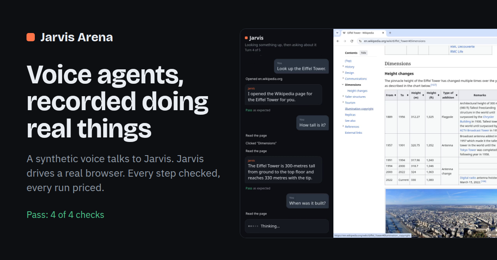

# Jarvis Arena

Run a voice-agent workflow on Cloudflare and get back a video of it, a pass or miss
for every step, and what it cost.

**See the runs: https://jarvis-arena.kapps.dev**



A **workflow** is a JSON file: what the user says, line by line, and what should be
true after each line. A run plays it as a scene:

1. A synthetic voice says the line (Workers AI, Deepgram Aura-2).
2. Jarvis hears it (Deepgram Nova-3), so mishearings are real.
3. Jarvis (an LLM with browser tools, GLM-4.7-Flash on Workers AI by default) acts on
   a real Chromium window and answers out loud.
4. The checks run (`url_includes`, `reply_matches`, `page_includes`).

The whole screen — the phone pane on the left, the browser on the right — is recorded
with both voices, stored in R2, and shown next to the transcript and the cost.

Everything runs in your Cloudflare account: a Worker, one Container per run, D1, R2,
Workers AI. No API keys: the container's AI calls go through the Worker.

## Deploy your own

Needs a Cloudflare account on **Workers Paid** (Containers) and Docker locally (wrangler
builds the stage image).

```bash
npm install
npx wrangler d1 create jarvis-arena            # put the id in wrangler.jsonc
npx wrangler r2 bucket create jarvis-arena-videos
npx wrangler d1 migrations apply jarvis-arena --remote
# wrangler.jsonc: set "GATEWAY" to your AI Gateway id, or "" to call Workers AI directly
npx wrangler deploy                             # first deploy uploads a ~1.2 GB image
openssl rand -hex 24 | npx wrangler secret put ADMIN_TOKEN
```

Before deploying, edit `wrangler.jsonc` for your account:
- `routes`: your own domain, or delete the line to use `*.workers.dev`;
- `GATEWAY`: your AI Gateway id, or `""`;
- `ACCESS_*`: a Cloudflare Access app on `<your host>/admin`, or empty to use the token only.

Then open `https://<your host>/login?token=<ADMIN_TOKEN>`: it takes you to `/admin`, where
each workflow has a **Run** button. A run takes 2–4 minutes. The public pages (`/`,
`/runs/<id>`) show every run read-only; only `/admin` can start one.

Optional, and off unless set: `FEEDBACK_KEY` (the feedback form posts to the author's
inbox; change `INBOX` in `src/site.ts` to yours) and `KSTATS_KEY` (first-party analytics;
remove the `k.js` tag in `src/pages.ts` if you do not use kstats).

## What a run costs

Measured per run and shown on the run page, from list prices (`PRICES` in
`src/index.ts`, dated): the container (2 vCPU / 8 GiB while it runs), the model's tokens,
TTS characters, STT minutes. Workers Paid's monthly included usage is not subtracted.

## Write a workflow

```json
{
  "name": "wiki-lookup",
  "title": "Looking something up, then asking about it",
  "start_url": "about:blank",
  "context": "What Jarvis is told for this task.",
  "lines": [
    { "text": "Open Wikipedia.", "expect": { "url_includes": "wikipedia.org" } },
    { "text": "How tall is it?", "expect": { "reply_matches": "3[0-9]{2}" } }
  ]
}
```

`say` overrides what is spoken when the spelling would mislead the voice ("code base").
Add the file to `workflows/` and to the import list in `src/index.ts`.

## Layout

| | |
|---|---|
| `src/index.ts` | Worker: routes, the Run Durable Object, AI for the container, cost |
| `src/pages.ts` | Pages: runs, one run, about, privacy, feedback, admin |
| `src/access.ts` | The admin gate (Cloudflare Access JWT, or the token) |
| `src/site.ts` | Feedback, analytics forwarder, robots |
| `scripts/check-390.mjs` | Phone check of every public page, light and dark |
| `stage/` | The container: `server.mjs` (scene runner), `phone.html` (the phone pane), `Dockerfile` |
| `workflows/` | Workflow files |

## Status

Early. Jarvis here is a plain model with four browser tools, and it is slow (often 10–20 s
an answer) and sometimes asks instead of acting. That is the point of recording it: the
next steps are replays (a pass rate, not one lucky run), stricter checks, and several
models side by side. Ideas and workflows are welcome: open an issue, or use the feedback
form on the site.

## License

MIT. Fonts: SIL Open Font License (`public/fonts/README.md`).
